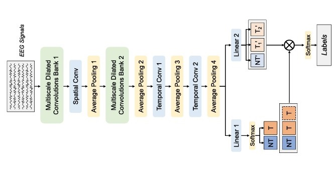

# MDCNet

The official implementation of **[Preliminary Study on Rapid Serial Visualization Presentation Multi-Class Target EEG Classification](https://ieeexplore.ieee.org/abstract/document/10629193)**.



MDCNet consists of a temporal feature extractor and an attention-guided classifier. The extractor uses two multiscale dilated convolution banks along the time axis, followed by depthwise separable spatial convolution and subsequent temporal convolutions with pooling, to obtain compact spatiotemporal EEG representations. The classifier employs two fully connected layers: a binary target/non-target branch whose target score gates the outputs of a three-class branch (target 1, target 2, non-target). Joint training of both branches enables the binary decision to serve as an attention signal that enhances multi-class RSVP-EEG target discrimination.


## 1&nbsp; Installation

Follow the steps below to prepare the virtual environment.

Create and activate the environment:
```shell
conda create -n mdcnet python=3.10
conda activate mtreenet
```

Install dependencies:
```shell
pip install -r requirements.txt
```


## 2&nbsp; Data

### 2.1&nbsp; Dataset

In the experiment, we designed the difficulty increases with the task. Each task contains two different classes of targets, and the difficulty of the task is controlled by the similarity of the two targets. In the toy experiment, from Task1 to Task2 the difficulty increases; in the application-oriented experiment, from Task A to Task B, the difficulty increases. 

The toy experiment shows targets that were common to the general public, Task 1 includes the dog and cat as targets, and Task 2 includes Chihuahua and bulldog as targets. The targets we chose follow the Taxonomy, cat and dog belong to the same Class (Mammalia) but different Order, Chihuahua and bulldog belong to the same Class-Order-Family-Genus-Species. Hence the similarity between Chihuahua and bulldog was higher than that between cat and dog. At the same time, we conducted a subjective investigation in which the results were the same. The application-oriented experiment includes the remote sensing image target retrieval task, Task A includes two targets with different shapes: rectangular and capsule-shaped, Task B includes two targets that both were capsule-shaped. Hence the similarity between the two targets in Task A was higher than those in Task B. The images of the toy experiment were from the gallery websites and the images of the application-oriented experiments were from the DIOR dataset. 
 
We designed and implemented four independent multi-class target RSVP tasks to collect EEG data, and establish the “NeuBCI Multi-Class Target Detection RSVP EEG and EM Dataset”. Our collected dataset and corresponding data descriptions available at [https://doi.org/10.57760/sciencedb.ai.00009.](https://doi.org/10.57760/sciencedb.ai.00009.).


### 2.2&nbsp; Data Acquisition

The EEG data are recorded using a SynAmp2 Amplifier (NeuroScan, Australia) with a 64-channel Ag/AgCl electrode cap following the international 10-20 system. The electrode impedances are maintained below 10 kΩ, with AFz serving as the ground electrode and the vertex as the reference. Data are sampled at 1000 Hz.

### 2.3&nbsp; Data Preprocessing

In the EEG preprocessing, first, the signal was downsampled to 250 Hz, then filtered the signal with a bandpass filter, and a 0.5–15 Hz three-order Butterworth filter was adopted. After that, the continuous EEG was epoched into trials, from the onset of the presented image to 1000 ms after the onset and the EEG of −200–0 ms was used for baseline correction. Last, each trial was normalized to zero mean unit standard deviation by channel. After the preprocessing, the collected EEG was organized into a data array that shaped (task number × trial number × channel number × time points). For each subject of Task 1 and Task 2, EEG data was shaped (2 ×3000×64×250), and for each subject of Task A and Task B, EEG data was shaped (2 × 4000 × 64 ×250).The dataset contains preprocessed EEG data of all 30 subjects and one documentation (pdf). EEG data of each subject was saved into one file in “.mat” format, the usage of the data file can be found in the documentation.


## 3&nbsp; Train

The MTREE-Net is trained with the Adam optimizer under a within-subject decoding scheme. For each subject, we adopt an outer K-fold cross-validation, where each fold is used once as the test set and the remaining data constitute the training pool. Within each outer fold, the training data are further split into training and validation sets to tune the model with joint losses on the three-class and auxiliary binary outputs, incorporating class-balanced weights to address class imbalance. Early stopping and a learning-rate scheduler based on validation loss are applied, and the best checkpoint on the validation set is finally evaluated on the held-out test fold.

```bash
python /MDCNet/main.py
```

## 4&nbsp; Cite

If you find this code or our MDCNet paper helpful for your research, please cite our paper:

```bibtex
@article{wei2024preliminary,
  title={Preliminary study on rapid serial visualization presentation multi-class target eeg classification},
  author={Wei, Wei and Li, Xujin and Qiu, Shuang and He, Huiguang},
  journal={IEEE Transactions on Biomedical Engineering},
  year={2024},
  publisher={IEEE}
}
```
